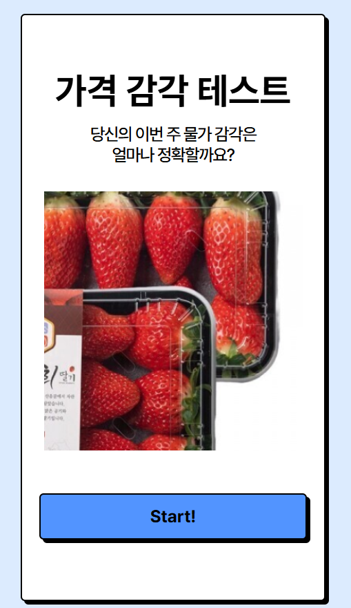
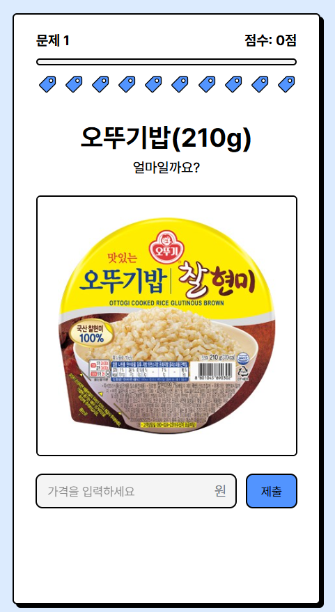
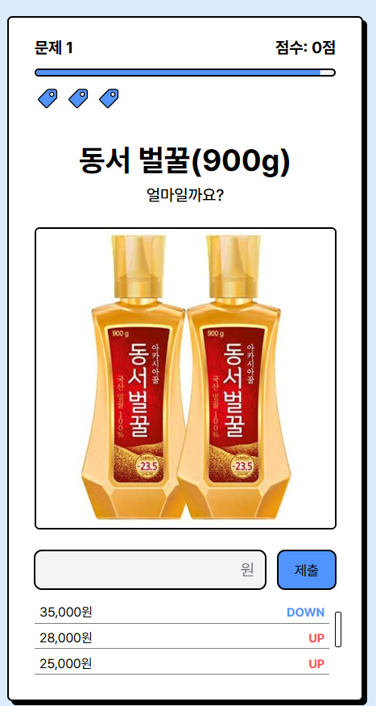
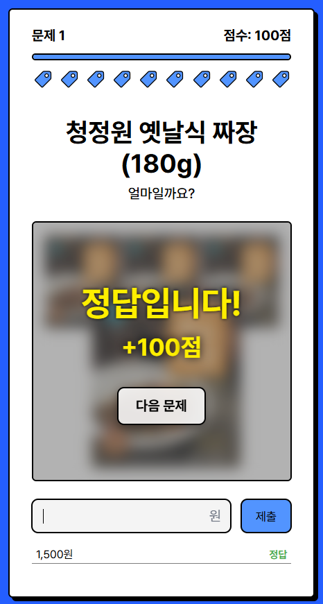
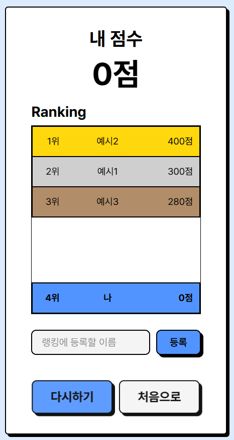

# 🛒 가격 감각 테스트 🏷️

**당신의 이번 주 물가 감각은 얼마나 정확할까요? 💰**

## 🔗 온라인 데모

**데모 체험하기:** [https://hhyyn.github.io/price-guessing-game/](https://hhyyn.github.io/price-guessing-game/)

생필품의 가격을 맞히는 게임을 통해 당신의 물가 감각을 테스트해보세요!<br />
공공데이터포털의 **한국소비자원_생필품 가격 정보 API**와 **네이버 이미지 검색 API**를 활용하여 최신 물가 정보를 제공합니다.

## 🎮 게임 소개
- **게임 방식**: 화면에 표시된 제품의 가격을 업다운을 통해 맞혀보세요 🔍
- **목숨 시스템**: 각 문제당 10번의 기회가 주어집니다 ❤️ x 10
- **점수 시스템**: 적은 시도로 빠르게 맞힐수록 더 높은 점수를 획득합니다 🏆
- **최신 정보**: 격주마다 업데이트되는 가격 정보를 이용해 가장 최근 물가를 체험할 수 있습니다 📊

## 📱 게임 화면
### 1. 메인 화면


### 2. 문제 화면


### 3. 여러 번 시도한 상황


### 4. 정답 화면


### 5. 게임 오버 화면



## 📂 주요 프로젝트 구조

```
price-guessing-game/
├─ api/                # API 연동 및 이미지 처리 관련 코드
├─ pages/              # 주요 게임 페이지
│  ├─ Intro/          # 시작 화면
│  ├─ Question/       # 문제 화면 및 게임 로직
│  └─ Result/         # 결과 화면
├─ components/         # 게임 내 사용되는 UI 컴포넌트
│  ├─ LifeCounter/    # 생명력 표시 컴포넌트
│  ├─ PriceInput/     # 가격 입력 컴포넌트
│  └─ ui/             # 공통 UI 요소
└─ data/               # 제품 ID 및 게임 데이터
```

## 📊 데이터 출처

- 한국소비자원_생필품 가격 정보 (공공데이터포털) 🛒
- 네이버 이미지 검색 API 🔍

## 📝 참고사항

- 본 프로젝트는 원래 API에서 실시간으로 데이터를 가져와 반영하도록 설계되었습니다.
- 그러나 API에서 제공되는 데이터 중 상당수가 무효 데이터(null)로 확인되었습니다.
- 무효 데이터가 많아 랜덤으로 데이터를 가져오는 과정에서 로딩 시간이 과도하게 길어져 정상적인 게임 진행이 어려웠습니다 ⏱️
- 이러한 문제를 해결하기 위해, 현재 데모 버전에서는 API에서 미리 가져온 몇천 개의 데이터를 전처리하여 사용하고 있습니다.
- 추후 실시간 데이터 반영으로 업데이트할 예정입니다.

## 🚧 개발 중인 기능

- 랭킹 시스템 - 사용자들의 점수를 기록하고 비교할 수 있는 기능이 개발 중입니다 🏆
- UI/UX 개선 - 파비콘, 페이지 제목 등 세심한 디테일들을 지속적으로 개선하여 완성도를 높여나갈 예정입니다 ✨